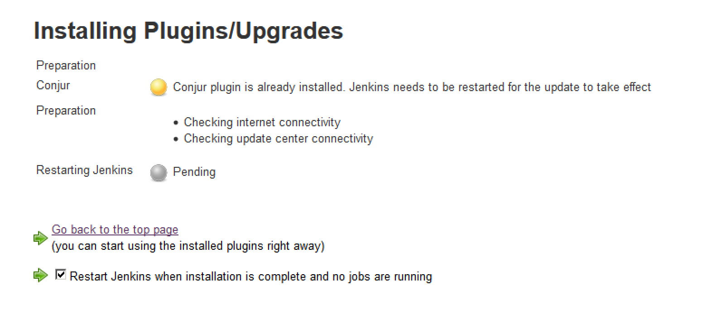
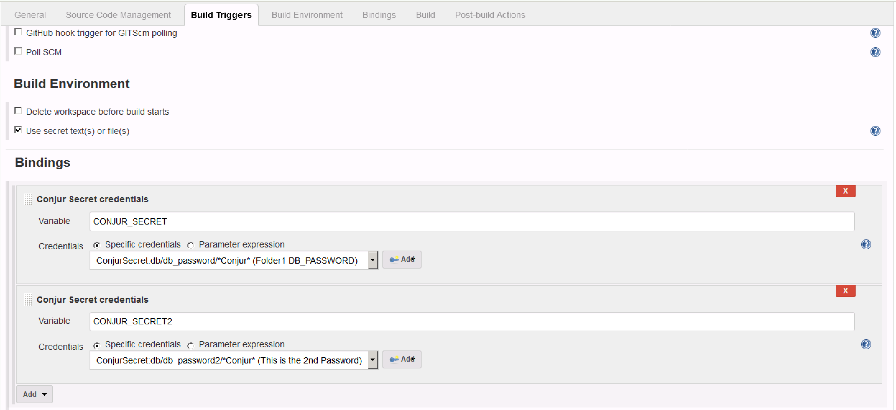

# conjur-credentials-plugin
Conjur plugin for securely providing credentials to Jenkins jobs

## Installation

### From Source

To build the plugin from source you'll need Maven. You can build it like this:

```bash
git clone {repo}
cd conjur-credentials-plugin
mvn install -DskipTests
```
### From Binaries

As another option, you can use the latest .hpi found under the binaries folder

### Install in Jenkins

Once you have the .hpi file, in Jenkins as an administrator go to "Jenkins" -> "Manage Jenkins" -> "Manage Plugins" -> 	"Advanced". 
In the "Upload Plugin" section, browse for the .hpi and upload it to Jenkins:


Make sure to restart Jenkins after the installation of the plugin:




## Usage

### Conjur Login Credential

Once the plugin is installed and Jenkins has been restarted you can start by storing the credential for Jenkins to connect to Conjur. 
The credential needs to be defined as standard "Username with password" credential. 

In the example Below, the username is defined as host/frontend/frontend-01 which is defined in my conjur policy, and I use the API key for that host as the password. 


### Global Configuration

You can define a global configuration for Conjur, so any job could use this configuration (unless is overriden at folder level). Here you define the Conjur Account, and Appliance URL to use. 


**Note**: The SSL Certificate can be linked to a certificate already stored in Jenkins (defined as credentials). If there is not SSL certificate associated, the requests to Conjur will fail unless there is a certificate locally defined in the cacerts of the JVM where the requests is being sent from or Conjur is not setup to use SSL. 

### Folder Property Configuration

You can override the global configuration by setting the Conjur Appliance information at Folder level, if the checkbox "Inherit from parent?" is checked, it means it will ignore the values set here, and go up the level navigating to the parent folder, or taking the global configuration if all folder up the hierarchy are inheriting from parent. 


**Note**: The SSL Certificate can be linked to a certificate already stored in Jenkins (defined as credentials). If there is not SSL certificate associated, the requests to Conjur will fail unless there is a certificate locally defined in the cacerts of the JVM where the requests is being sent from or Conjur is not setup to use SSL. 

### Conjur Secret Definition

You will need to define the secrets you want to access from Conjur in an explicit way, just define them as credentials of "Conjur Secret Credential" kind. 


### How to use from a Jenkins pipeline script

You can use `withCredentials` and use the symbol `conjurSecretCredential` to make reference to the Conjur secrets
Here is an example showing how to fetch the secret from a Jenkins job pipeline definition.

```yml
node {
   stage('Work') {
      withCredentials([conjurSecretCredential(credentialsId: 'DB_PASSWORD', variable: 'SECRET')]) {
         echo "Hello World $SECRET"
      }
   }
   }
   stage('Results') {
      echo "Finished!"
   }
}
```

### How to use from a Jenkins Freestyle Project

You can use the option "Use secret text(s) or file(s)" in the "Build Environment" section of a Freestyle project to bind to Conjur Secrets.



The secrets will be injected as environment variables to the build steps of the project. 


